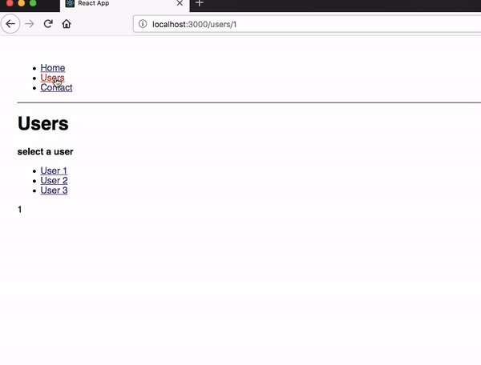

Nested routing helps us to render the sub-routes like users/1, users/2 etc.

_index.js_

```js
import React from 'react'
import ReactDOM from 'react-dom'
import './index.css'
import { Route, Link, BrowserRouter as Router, Switch } from 'react-router-dom'
import App from './App'
import Users from './users'
import Contact from './contact'
import Notfound from './notfound'

const routing = (
  <Router>
    <div>
      <ul>
        <li>
          <Link to="/">Home</Link>
        </li>
        <li>
          <Link to="/users">Users</Link>
        </li>
        <li>
          <Link to="/contact">Contact</Link>
        </li>
      </ul>
      <hr />
      <Switch>
        <Route exact path="/" component={App} />
        <Route exact path="/users" component={Users} />
        <Route path="/contact" component={Contact} />
        <Route component={Notfound} />
      </Switch>
    </div>
  </Router>
)
ReactDOM.render(routing, document.getElementById('root'))
```

## How to implement a nested routing?

In the users.js file, we need to import the react router components because we need to implement the subroutes inside the Users Component.

_users.js_

```js
import React from 'react'
import { Route, Link } from 'react-router-dom'

const User = ({ match }) => <p>{match.params.id}</p>

class Users extends React.Component {
  render() {
    const { url } = this.props.match
    return (
      <div>
        <h1>Users</h1>
        <strong>select a user</strong>
        <ul>
          <li>
            <Link to="/users/1">User 1 </Link>
          </li>
          <li>
            <Link to="/users/2">User 2 </Link>
          </li>
          <li>
            <Link to="/users/3">User 3 </Link>
          </li>
        </ul>
        <Route path="/users/:id" component={User} />
      </div>
    )
  }
}

export default Users
```


