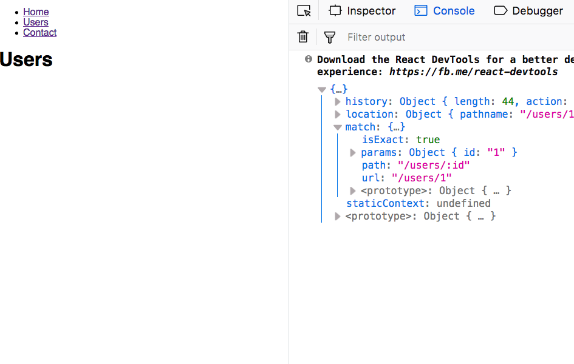
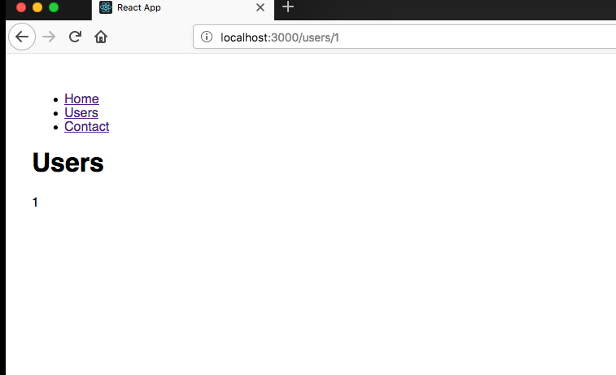

Url parameters helps us to render the same component based on its dynamic url like in our Users component assume that they are different users with id 1,2,3.

```js
<Route path="users/:id" component={Users} />
```

_index.js_

```js
import React from 'react'
import ReactDOM from 'react-dom'
import './index.css'
import { Route, Link, BrowserRouter as Router, Switch } from 'react-router-dom'
import App from './App'
import Users from './users'
import Contact from './contact'
import Notfound from './notfound'

const routing = (
  <Router>
    <div>
      <ul>
        <li>
          <Link to="/">Home</Link>
        </li>
        <li>
          <Link to="/users">Users</Link>
        </li>
        <li>
          <Link to="/contact">Contact</Link>
        </li>
      </ul>
      <Switch>
        <Route exact path="/" component={App} />
        <Route path="/users/:id" component={Users} />
        <Route path="/contact" component={Contact} />
        <Route component={Notfound} />
      </Switch>
    </div>
  </Router>
)

ReactDOM.render(routing, document.getElementById('root'))
```

Open users.js file and add console.log(this.props).

_users.js_

```js
import React from 'react'

class Users extends React.Component {
  render() {
    console.log(this.props)
    return <h1>Users</h1>
  }
}

export default Users
```

Now open your browser and manually type this url localhost:3000/users/1 you will see a object in your console which is passed by the react router.



Have you seen the params object with id 1 the same thing we passed in the url localhost:3000/users/1.

Let's render that id 1 in the screen.

_users.js_

```javascript
import React from 'react'

class Users extends React.Component {
  render() {
    const { params } = this.props.match
    return (
      <div>
        <h1>Users</h1>
        <p>{params.id}</p>
      </div>
    )
  }
}

export default Users
```



Have you seen now 1 is rendered in the screen in next tutorial we learn about nested routes instead of manually entering the users/1.
