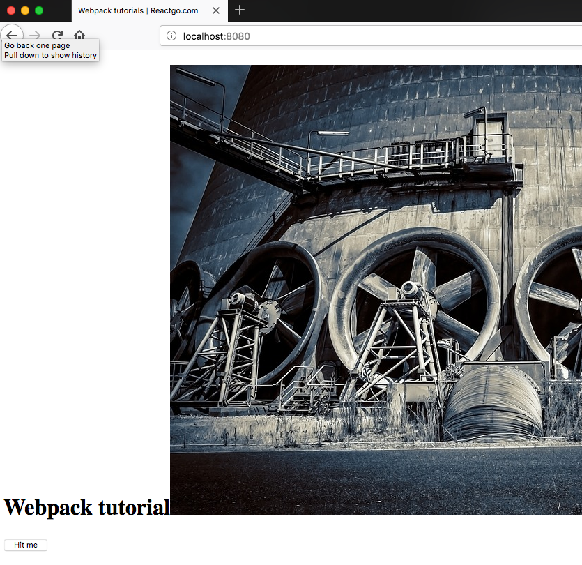

To load images we need to use url-loader and file-loader.

```bash
npm install -D  url-loader file-loader
```

Add a new rule to the  array

*webpack.config.js*

```js
 {
                test: /\.(png|jpg|gif|jpeg|ttf)$/,
                use: [
                    {
                        loader: 'url-loader',
                        options: {
                            limit: 8000
                        }
                    }
                ]
            }
```

Url-loader helps us to the load images as a base64 format if the image size is more than 8kb it will add an image instead of inlining it as a base64.


*fn.js*

```js
const btn = document.querySelector('.btn');
const title = document.querySelector('.title');
import './style.css';
import fan from './fan.jpg';

let active = false;

const img = document.createElement('img');
img.src = fan;

title.appendChild(img);


function changeColor() {

    active = !active
    if (active) {
        btn.className = 'gold'
        title.style.color = 'blue'
    } else {
        title.style.color = 'black'
    }
}

export default changeColor
```


