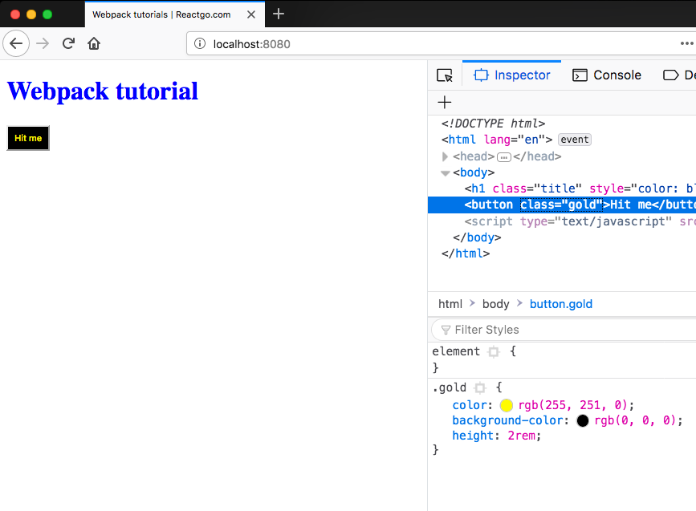

In this tutorial, you learn about how to import styles as a module with the help of css-loader and style loader.

Let's download both loaders now.

```bash
npm install -D style-loader css-loader
```

Add both loaders to rules set in the webpack config.


The order of processing loaders is right to left first css-loader runs and gives output to the style loader.

**css-loader** help us to import css file as a module.
**style-loader** help us to take that css and add it to the javascript file.

*webpack.config.js*

```js
var path = require('path');
const htmlWebpackPlugin = require('html-webpack-plugin');
module.exports = {
    entry: './app.js',
    output: {
        filename: 'bundle.js',
        path: path.resolve(__dirname, 'dist')
    },
    module: {
        rules: [
            { test: /\.js$/, use: "babel-loader" },
            { test: /\.css$/, use: ["style-loader", "css-loader"] },

        ]
    },
    plugins: [
        new htmlWebpackPlugin({
            template: './index.html'
        })
    ]
};
```

create a style.css file.

*style.css*

```css
.gold{
    color: rgb(255, 251, 0);
    background-color: rgb(0, 0, 0);
    height: 2rem;
}
```

*fn.js*

```js
const btn = document.querySelector('.btn');
const title = document.querySelector('.title');
import './style.css';
let active = false;

function changeColor() {

    active = !active
    if (active) {
        btn.className = 'gold'
        title.style.color = 'blue'
    } else {
        title.style.color = 'black'
    }
}

export default changeColor
```



But if you run build command there is no style.css file present inside the dist folder because css is also added in the bundle.js file.

Let's extract the css in a separate file instead of adding it in bundle.js.

```bash
npm install -D mini-css-extract-plugin
```


*webpack.config.js*

```js
var path = require('path');
const htmlWebpackPlugin = require('html-webpack-plugin');
const MiniCssExtractPlugin = require('mini-css-extract-plugin');

module.exports = {
    entry: './app.js',
    output: {
        filename: 'bundle.js',
        path: path.resolve(__dirname, 'dist')
    },
    module: {
        rules: [
            { test: /\.js$/, use: "babel-loader" },
            {
                test: /\.css$/, use: [MiniCssExtractPlugin.loader, "css-loader"]
            },

        ]
    },
    plugins: [
        new htmlWebpackPlugin({
            template: './index.html'
        }),
        new MiniCssExtractPlugin({
            filename: "[name].css"
        })
    ]
};
```
Now if you run a build command you will see a main.css file.

```bash
npm  run build
```

In the next tutorial, you will learn about how to deal with images in webpack.