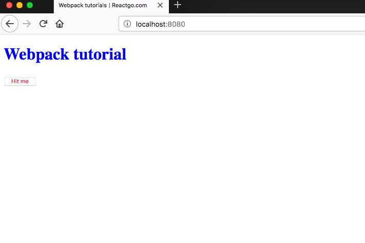

## Webpack dev server

Webpack dev server is used to spin up a server so that we can develop our app in the local environment.

Let's install the webpack dev server.

```bash
npm install webpack-dev-server -D
```

add a start script to the package.json file.

```json
  "scripts": {
    "start": "webpack-dev-server",
  }
```

If you run npm start you will see a live server is running at localhost:8080.

```bash
ℹ ｢wds｣: Project is running at http://localhost:8080/
ℹ ｢wds｣: webpack output is served from /
⚠ ｢wdm｣: Hash: 91b872e75f3114fa321c
Version: webpack 4.19.0
Time: 4630ms
Built at: 2018-09-17 07:31:39
    Asset     Size  Chunks             Chunk Names
bundle.js  140 KiB       0  [emitted]  main
Entrypoint main = bundle.js
```

